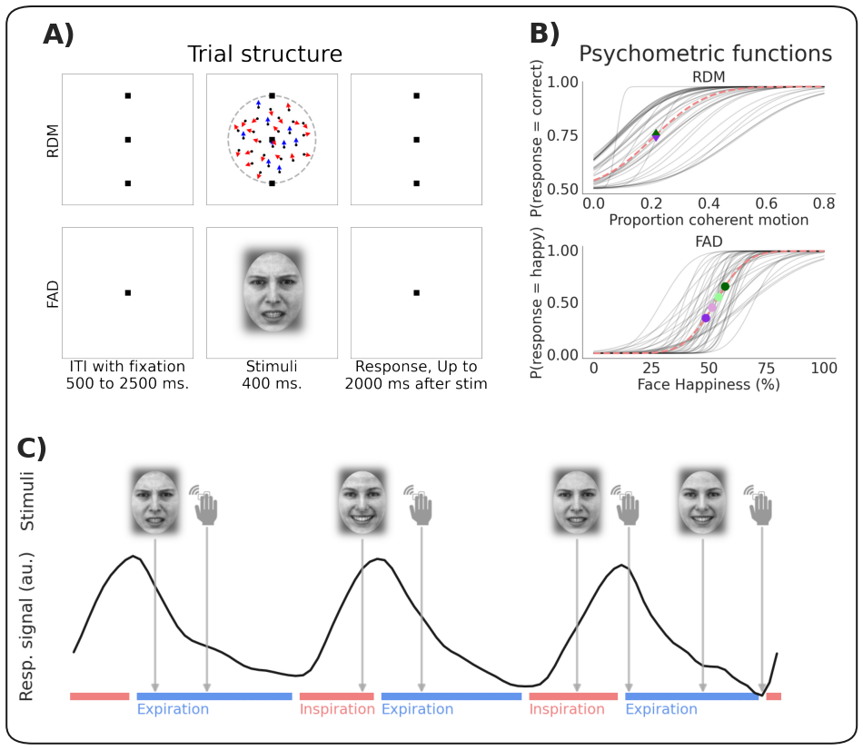
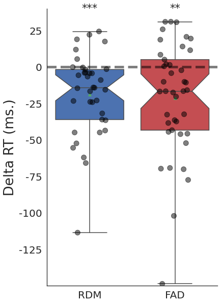

# The respiratory cycle modulates distinct dynamics of affective and perceptual decision-making

**Malthe Brændholt1, Niia Nikolova1, Melina Vejlø1, Leah Banellis1, Francesca Fardo1,2, Daniel S. Kluger3,4, Micah Allen1,5**

1Center of Functionally Integrative Neuroscience, Aarhus University, Aarhus, Denmark  
2Danish Pain Research Center, Aarhus University, Aarhus, Denmark  
3Institute for Biomagnetism and Biosignal Analysis, University of Muenster, Muenster, Germany  
4Otto Creutzfeldt Center for Cognitive and Behavioral Neuroscience, University of Muenster, Muenster, Germany  
5Cambridge Psychiatry, Cambridge University, Cambridge, UK  

**Abstract**  
Respiratory rhythms play a critical role not only in homeostatic survival, but also in modulating other non-interoceptive perceptual and affective processes. Recent evidence from both human and rodent models indicates that neural and behavioural oscillations are influenced by respiratory state as breathing cycles from inspiration to expiration. To explore the mechanisms behind these effects, we carried out a psychophysical experiment where 41 participants categorised dot motion and facial emotion stimuli in a standardised discrimination task. When comparing behaviour across respiratory states, we found that inspiration accelerated responses in both domains. We applied a hierarchical evidence accumulation model to determine which aspects of the latent decision process best explained this acceleration. Computational modelling showed that inspiration reduced evidential decision boundaries, such that participants prioritised speed over accuracy in the motion task. In contrast, inspiration shifted the starting point of affective evidence accumulation, inducing a bias towards categorising facial expressions as more positive. These findings provide a novel computational account of how respiratory rhythms modulate distinct aspects of perceptual and affective decision-dynamics.

**Preprint**  
[Preprint Link](preprint_link_here)

**Institutions**
- Center of Functionally Integrative Neuroscience, Aarhus University
- Danish Pain Research Center, Aarhus University
- Institute for Biomagnetism and Biosignal Analysis, University of Muenster
- Otto Creutzfeldt Center for Cognitive and Behavioral Neuroscience, University of Muenster
- Cambridge Psychiatry, Cambridge University

**Figures and Legends**
### Figure 1: Experimental design

A) Trial structure of the random dot motion (RDM) and face affect discrimination (FAD) stimuli. B) Estimated psychometric functions for both RDM and FAD stimuli. Grey lines show individual participants’ traces, dashed red shows the group mean. Green and purple symbols indicate examples of the selected stimulus intensities used in the test trials. C) Each test trial was labelled both by the respiratory state at stimulus onset and at the time of response as indicated by the face and hand icons respectively. Face icons show examples of angry and happy stimuli. Red and blue lines represent periods of inspiratory and expiratory states respectively. ITI: Intertrial interval

### Figure 2: Expiration to inspiration differences in reaction time

Boxplots depicting the difference (delta) in median reaction time during inspiration vs. expiration, based on response grouping for each domain. Positive values indicate higher values during inspiration compared to expiration. Dots indicate individual participant delta-medians. Notches indicate 95% CI of the median. RDM: Random dot motion, FAD: Face affect discrimination. **p < 0.01, ***p < 0.001

### Figure 3: Evidence accumulation models

Drift Diffusion Modelling of Respiratory State Effects on Decision-Making. A) Schematic representation of the drift diffusion model (DDM) visualising the drift rate (v), non-decision time (t), bias (z), and decision threshold (a). B) Fitted group level DDM parameters and posterior predictive checks for the random dot motion (RDM) model and C) face affect discrimination (FAD) model. Drift rate was fitted for each stimulus class as shown by different coloured lines. Bold lined histograms represent the empirical reaction time histogram for each stimulus type and for each response option accumulated over time across all participants. Shaded lines represent the histograms of 100 data sets simulated based on the estimated model parameters. Note that the empirical and simulated data contains reaction times faster than the depicted group level non-decision time since some participants have shorter non-decision time than the group. D) Posterior predictive distributions for differences in DDM parameters by respiratory state. We found a significant reduction in decision threshold (P =  0.008) and drift rate of upwards stimuli (P =  0.013) for RDM, and a positive affective bias towards 'happy' responses during inspiration for FAD (P = 0.048). No significant shifts were found in drift rate of other stimuli, decision threshold in FAD or for non-decision time (all P > 0.05). Each parameter's 95% highest posterior density interval (HPDI) is shown, reflecting the effect of respiration on decision dynamics. AL: angry, low ambiguity, AH: angry, high ambiguity, HH: happy, high ambiguity, HL: happy, low ambiguity.

**About**  
A repository for our manuscript investigating the modulation of affective and perceptual decision-making by the respiratory cycle.

**Keywords**  
respiration, perception, affect, evidence accumulation, hierarchical drift diffusion model (HDDM)
